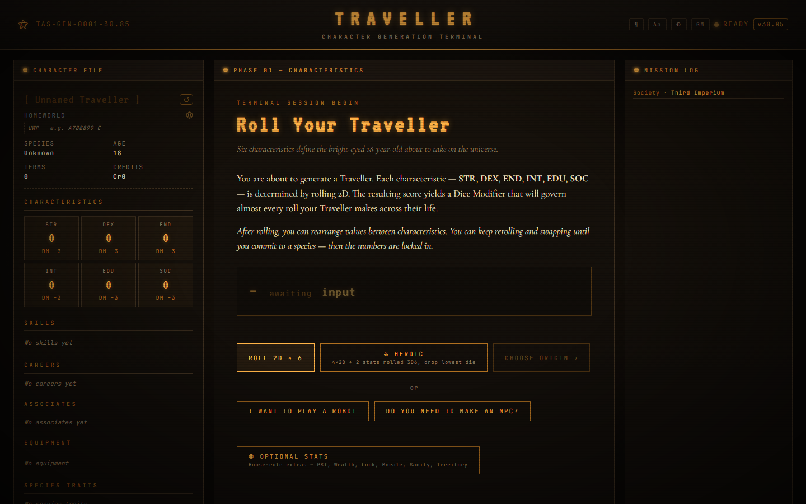
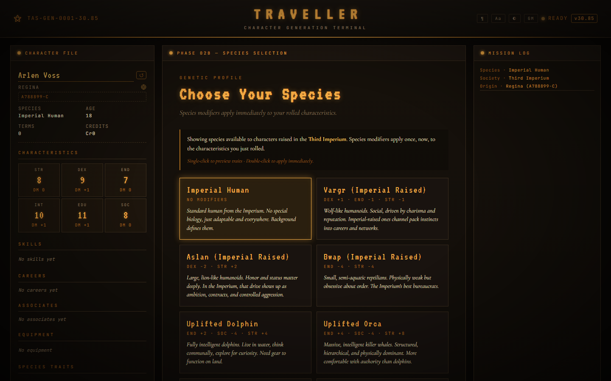
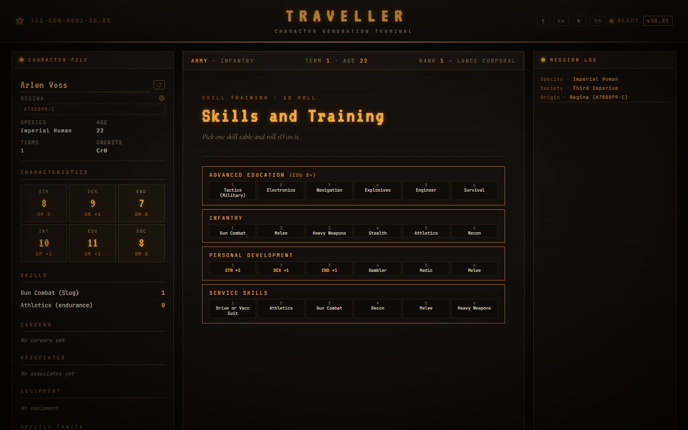
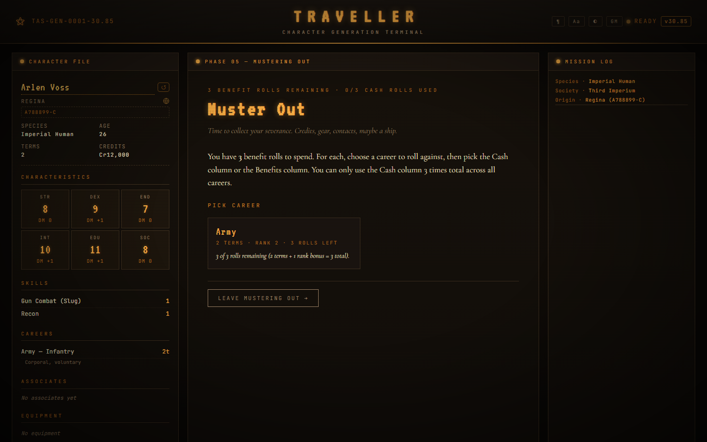
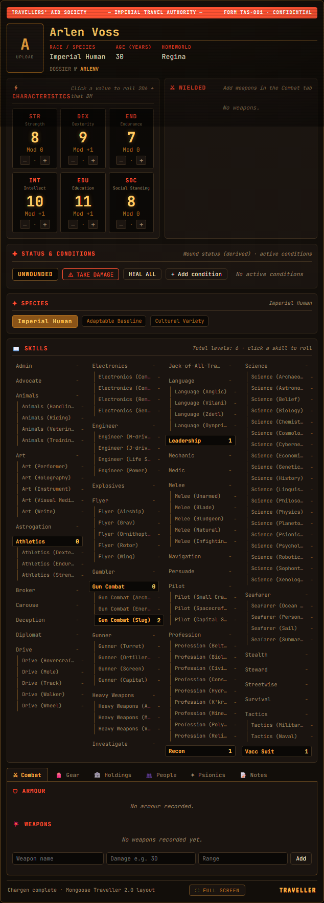

# Traveller Character Creator

A web app for generating Mongoose Traveller 2e characters through the complete lifepath system — characteristics, species, pre-career education, careers (qualify, survive, events, mishaps, advancement, aging), mustering out, psionics, and a final character sheet with capsule description. Supports background packages and career packages as streamlined one-step alternatives to the traditional lifepath phases. Also includes a full **robot construction system** that bypasses the lifepath entirely, and a **batch NPC generator** with optional bring-your-own-AI written backgrounds.

Built as a Docker-packaged FastAPI + Jinja2 + vanilla JS stack. All rules data lives in editable JSON files — no code changes required to add a new career, species, or tweak a table.

  

> **Not official:** This is an unofficial fan tool. It is not produced, endorsed, licensed, or authorized by Far Future Enterprises or Mongoose Publishing. Please use it with legally purchased Traveller rulebooks.

## Current status

This project is usable but still considered a testing build. Character output should be checked against the relevant rulebooks.

## Screenshots

| Start screen | Species choice |
|---|---|
|  |  |

| Career term | Mustering out | Final sheet |
|---|---|---|
|  |  |  |

---

## Running it

```bash
docker compose up
```

Open <http://localhost:8000>. That's it.

The `app/` directory is mounted as a volume — edits to JSON rule files, templates, CSS, or Python hot-reload without a rebuild. Refresh the browser (or `POST /api/reload-rules`) to pick up JSON changes.

Without Docker:

```bash
pip install -r requirements.txt
uvicorn app.main:app --reload
```

---

## Exporting to Foundry VTT

> **If your goal is to play in Foundry, click "Export to Foundry" — not "Export JSON".** This is the single most common point of confusion: "Export JSON" is for *saving and re-loading your character in this creator*, not for Foundry.

Create your character and continue all the way until you reach the **"Your Traveller is Ready"** screen. About halfway down the page you'll see three buttons and a checkbox:

| Button | What it does |
|---|---|
| **Export JSON** | Saves the full character state as a `.json` file so you can **re-import it back into this character creator** later (e.g. to keep building, or to back it up). **This is not a Foundry file.** |
| **Export to Foundry** | Produces a **FoundryVTT MGT2e actor** file for importing into Foundry. This is the one you want for play. |
| **Back to Careers** | Returns to the lifepath to keep editing. |

There is also a checkbox:

> *"Foundry export: include editable source (re-importable here losslessly; uncheck for a lean VTT-only file)."*

**The checkbox only affects whether the exported Foundry file can later be imported back into *this* character creator without losing detail. It does *not* change anything about importing into Foundry** — leave it checked if you might want to round-trip the character back here; uncheck it for a smaller, VTT-only file.

### Step by step

1. On the **"Your Traveller is Ready"** screen, click **Export to Foundry**.
2. The downloaded file will be named something like **`CharacterName_foundry.json`**. **If the filename does *not* end with `_foundry.json`, you clicked *Export JSON* by mistake** — go back and click *Export to Foundry* instead.
3. In Foundry, create a new **Actor / Character**.
4. **Right-click** the new actor and choose **Import**.
5. Select the `_foundry.json` file you downloaded.

Your characteristics, skills (with specialties), career history, finance, sophont data, equipment, and any AI-written background all come across into the Foundry actor.

---

## What's implemented

### Full lifepath phases

1. **Characteristics** — Roll 2D×6 for all six stats, with optional stat swaps. Heroic mode rolls 4×2D normally and 2×3D6 drop-lowest for the highest two. Optional extra characteristics (PSI, WLT, LCK, MRL, STY, TER) can be toggled on and rolled separately with the same heroic option.
2. **Society of Origin** — Choose the polity where your character was raised (Third Imperium, Solomani Confederation, Aslan Hierate, Hiver Federation, Zhodani Consulate, Two Thousand Worlds, Vargr Extents, or Other/Far Domains). Filters the species picker and career list to only show options relevant to that society.
3. **Species** — Pick a species from those available in your chosen society; modifiers and traits are applied automatically. Noble titles granted to high-SOC Third Imperium characters. Solomani characters roll a Heritage Roll (2D) to determine sub-type. Cetacean species (Dolphin, Orca) set a species-specific starting age.
4. **Background skills** — Skill picks gated by EDU DM, or take a **Background Package** (see below) for a curated skill bundle in lieu of individual picks.
5. **Pre-career education** — Optional phase before the career loop (see below).
6. **Career loop** — Qualify → assignment → basic training → skill training → anagathics offer → survival → event → mishap (if failed survival) → advancement → end term (aging at species-appropriate term). Repeats for as many careers and terms as the player chooses. On the **first** career pick only, a **Career Package** can be chosen instead (see below) — skips the loop entirely and goes straight to finalization.
   - *Zhodani Noble and Intendant characters* enter an interactive **psionic training phase** before careers begin. They attempt up to 6 talents from the Consulate training table (2D + PSI DM + talent DM vs 8+; each attempt applies a cumulative DM−1). Proles skip this phase.
   - **Career picker flags** — previously ejected careers are shown as non-clickable red cards. Careers blocked by species or society restrictions are shown as locked purple cards with the reason displayed (e.g. "Non-Solomani humans cannot join the Party"). Both types are visible in the picker so the player knows why they are unavailable.
7. **Mustering out** — Cash and benefit rolls per career. Each career's roll allowance is terms served + rank bonus (ranks 1–2: +1, ranks 3–4: +2, ranks 5+: +3). Retirement pension calculated automatically for 5+ terms served.
8. **Skill packages** — Optional package pick at the end of mustering out.
9. **Psionics** — Optional PSI test and talent training (available pre-career or between terms with GM permission).
10. **Finalize** — Capsule description generated, character sheet rendered, PDF/JSON/FoundryVTT export.

### Robot construction (alternative to the lifepath)

A **"I WANT TO PLAY A ROBOT"** button appears on the characteristics screen — no dice rolling required. Clicking it opens the Robot Construction phase, a six-tab builder based on the Mongoose Traveller Robot Handbook rules. The robot bypasses the entire lifepath.

| Tab | Contents |
|---|---|
| **FRAME** | Chassis size (Size 1–8), armour, power packs, resiliency/light-hit modifications |
| **BRAIN** | Brain family (Primitive → Conscious), bandwidth upgrades, INT boost, hardened option |
| **MOBILITY** | Primary locomotion type (Wheels, Walker, Grav, etc.), agility boost, speed modifier, vehicle speed mode, secondary locomotion |
| **EQUIPMENT** | Additional manipulators, 35-item installed-systems checklist, custom options |
| **SKILLS** | Skill software packages (name + level 0–4) with specialty dropdowns for cascade skills (Gun Combat → Energy/Slug/Archaic, Electronics → Comms/Computers/Sensors, etc.) |
| **FINALIZE** | Robot name/purpose/TL, derived characteristics, build validation, Finalize button |

A live totals bar (Slots / Bandwidth / Hits / Protection / Speed / Cost) is always visible at the top of the builder.

**Derived characteristics** are computed from the construction:

| Characteristic | Source |
|---|---|
| STR | Primary manipulator base STR |
| DEX | Primary manipulator DEX + agility DM |
| END | Total hits |
| INT | Brain INT + boost |
| EDU | Total brain bandwidth |
| SOC | 0 |

On finalize, the robot goes directly to a done screen with a **⬇ EXPORT TO FOUNDRY** button that generates a FoundryVTT MGT2e actor JSON entirely client-side. The edit robot button returns to the Finalize tab to continue tweaking.

### Pre-career education (7 tracks)

| Track | Requirement | Duration | Notes |
|---|---|---|---|
| **University** | INT 6+ | 4 years (+2 age) | +1 EDU on enrol; graduate for +2 EDU and 2 skills at level 1; Honours adds SOC+1 and DM+1 to first qualification |
| **Military Academy** | Varies by service | 3 years (+1 age) | Service-specific qualification; graduate with Honours for automatic commission rank; full education event table |
| **Merchant Academy** | INT 9+ | 4 years (+2 age) | Business or Shipboard curriculum; graduate for +1 EDU, start Merchant/Citizen at officer rank, permanent advancement DM |
| **Colonial Upbringing** | Homeworld TL ≤ 8 (automatic) | — | Survival 1 + 10 skills at 0; graduate for END+1 and Jack-of-all-Trades 1, but EDU−D3 and permanent qualification penalties |
| **School of Hard Knocks** | SOC ≤ 6 (automatic) | — | Streetwise 1 + 2 skill picks; graduate for Gun Combat 0 + 3 more skills, but DM−2 commission in first career |
| **Spacer Community** | Homeworld size 0, INT 4+ (automatic) | 3 years | Vacc Suit 1 + 2 picks; graduate for DEX+1, Pilot 0, and permanent DM+1 to Merchant (Free Trader) advancement |
| **Psionic Community** | PSI 8+ after test | 3 years | Tests PSI on enrolment; psionic talent training; graduate for PSI+1 and permanent Psion career auto-entry |

Ineligible tracks are visible in the picker as greyed-out cards explaining the requirement.

### Background Packages (alternative to background skills)

At the background phase the player may choose a **Background Package** instead of picking individual background skills. Each package represents a specific upbringing and grants a curated set of skills, starting credits, and (for some packages) stat adjustments — no EDU gating, no individual picks required.

| Package | Highlights |
|---|---|
| **Belter** | Vacc Suit, Zero-G, Mechanic, Astrogation 0; Cr2,000 |
| **Criminal** | Stealth, Streetwise, Deception; Cr1,000 |
| **Drifter** | Survival, Recon, Athletics (endurance); Cr500 |
| **Farmer** | Animals, Survival, Athletics (endurance); Cr2,000 |
| **Merchant Family** | Broker, Persuade, Admin; Cr3,000 |
| **Military Family** | Athletics, Gun Combat 0, Melee 0, Discipline; Cr1,000 |
| **Noble Birth** | Admin, Carouse, Diplomat, Persuade; SOC+1; Cr5,000 — requires SOC 10+ |
| **Primitive** | Survival, Animals, Recon; STR+1, END+1, EDU−1; Cr200 |
| **Scholar Family** | Science 0, Electronics (computers), Investigate; Cr2,000 |
| **Spacer** | Vacc Suit, Mechanic, Pilot (small craft); Cr1,500 |
| **Street Kid** | Streetwise, Stealth, Athletics (dexterity); Cr500 |
| **Technical** | Mechanic, Electronics 0, Engineer 0; Cr2,500 |

### Career Packages (alternative to the career loop)

On the **first** career pick only, a **Career Package** button appears in the career picker. Choosing it bypasses the qualify/survive/advance loop entirely. The player:

1. Selects one of 17 packages representing a complete pre-defined career.
2. Rolls d3 and adds the result to their age.
3. Picks one option from each of three finalising categories:

| Category | Choices |
|---|---|
| **CAREER** | Boost one skill to level 4 · Boost three skills by +1 each · Take rank 4 only |
| **TRAVELLER SKILLS** | One of 12 pairs of useful traveller skills (e.g. Vacc Suit + Steward, Pilot (any) + Astrogation, …) |
| **BENEFITS** | 1 Ship Share · Cr100,000 cash · Combat Implant · 1 Ally + 2 Contacts · TAS Membership · SOC +1 |

The character goes directly to finalization (skill package phase) — no further careers can be added.

| Package | Rank | Notes |
|---|---|---|
| **Barbarian** | 2 | STR+1, END+1; Survival, Melee, Recon |
| **Bounty Hunter** | — | Gun Combat, Investigate, Deception, Pilot |
| **Corsair** | 2 | SOC−2; Gunner, Melee, Pilot, Astrogation; 1 Ship Share base |
| **Corporate Executive** | 4 | EDU+1, SOC+1; Admin, Advocate, Broker, Leadership |
| **Doctor** | — | EDU+1; Medic 3, Science, Admin |
| **Drifter** | — | Survival, Streetwise, Recon, Mechanic |
| **Explorer** | 3 | Recon, Survival, Pilot, Astrogation, Navigation |
| **Merchant Captain** | 4 | Pilot, Broker, Admin, Astrogation; 2 Ship Shares base |
| **Military Officer** | 4 | Gun Combat 2, Leadership 2, Tactics; END+1 |
| **Noble** | 4 | SOC+2 (min SOC 10); Admin, Advocate, Carouse, Diplomat |
| **Pilot** | 2 | Pilot 3, Astrogation, Mechanic, Vacc Suit |
| **Rogue** | 2 | Gun Combat, Stealth, Deception, Streetwise |
| **Scholar** | — | EDU+1; Science 3, Science 1, Investigate, Computer |
| **Scout** | 3 | Astrogation 2, Pilot, Recon, Survival, Vacc Suit |
| **Soldier** | 3 | END+1; Gun Combat 2, Melee, Heavy Weapons, Athletics |
| **Technician** | — | Mechanic 2, Electronics 2, Engineer; EDU+1 |
| **Wanderer** | — | Survival, Recon, Stealth, Streetwise |

### Careers (89 fully encoded)

Every career has qualification, all assignments, full skill tables, events (2–12), mishaps (1–6), rank tracks with bonuses, and mustering-out tables.

#### Third Imperium (13)

| Career | Assignments |
|---|---|
| **Agent** | Law Enforcement, Intelligence, Corporate |
| **Army** | Support, Infantry, Cavalry |
| **Citizen** | Corporate, Worker, Colonist |
| **Drifter** | Barbarian, Wanderer, Scavenger |
| **Entertainer** | Artist, Journalist, Performer |
| **Marine** | Support, Star Marine, Ground Assault |
| **Merchant** | Merchant Marine, Free Trader, Broker |
| **Navy** | Line/Crew, Engineer/Gunner, Flight |
| **Noble** | Administrator, Diplomat, Dilettante |
| **Prisoner** | Thug, Thief, Enforcer |
| **Rogue** | Thief, Enforcer, Pirate |
| **Scholar** | Field Researcher, Scientist, Physician |
| **Scout** | Courier, Surveyor, Explorer |

#### Solomani Confederation (5)

| Career | Assignments | Notes |
|---|---|---|
| **Confederation Navy** | Line/Crew, Technical, Flight | Solomani-only; separate officer rank table |
| **Confederation Army** | Support, Infantry, Cavalry | Solomani-only |
| **Solomani Star Marines** | Support, Star Marine, Battledress | Solomani-only |
| **Solomani Party** | Official, Intellectual, Militant | Political career; restricted to pure Solomani (SOC 7+) |
| **SolSec** | Field Agent, Administration, Secret Agent | Secret Agent uses a cover career for survival/advancement rolls |

#### Cetacean (4)

| Career | Assignments | Species |
|---|---|---|
| **Dolphin Civilian** | Liaison, Nomad, Historian-Poet | Dolphin + Orca |
| **Dolphin Military** | Sea Patrol, Underwater Commando, Guardian | Dolphin + Orca |
| **Philosopher-Elder** | Philosopher-Elder | Orca only |
| **Spirit Singer** | Spirit Singer | Orca only |

#### Bounty Hunter (1, any society)

| Career | Assignments |
|---|---|
| **Bounty Hunter** | Tech Ops, Hunter, Fixer |

#### Aslan Hierate (11)

| Career | Assignments | Notes |
|---|---|---|
| **Ceremonial** | Poet, Clan Agent, Priest | Also available in Glorious Empire |
| **Envoy** | Negotiator, Spy, Duellist | Also available in Glorious Empire |
| **Management** | Corporate, Clan Aide, Governess | Female-dominant career |
| **Military** | Warrior, Cavalry, Flyer, Support | Male-dominant career |
| **Military Officer** | Leader, Executive Officer, Assassin | Male-dominant career |
| **Outcast** | Labourer, Trader, Scavenger | Hierate only |
| **Outlaw** | Pirate, Raider, Thief | Hierate only |
| **Scientist** | Healer, Researcher, Explorer | Hierate only |
| **Space Officer** | Commander, Shipmaster, Navigator | Male-dominant career |
| **Spacer** | Pilot, Gunner, Engineer, Crew | Hierate only |
| **Wanderer** | Belter, Nomad, Scout | Hierate only |

#### Glorious Empire (8)

| Career | Assignments | Notes |
|---|---|---|
| **Ceremonial** | Poet, Clan Agent, Priest | Shared with Hierate |
| **Envoy** | Negotiator, Spy, Duellist | Shared with Hierate |
| **Fleet** | Pilot, Gunner, Engineer, Crew | GE exclusive |
| **Fleet Officer** | Commander, Shipmaster, Navigator | GE exclusive |
| **Landless One** | Labourer, Wildcatter, Trader, Slaver | GE exclusive |
| **Slave** | Labourer, Servant, Technician, Dog Soldier | GE exclusive |
| **Warrior** | Imperial Guard, Dragoon, Support | GE exclusive |
| **Warrior Officer** | Leader, Executive Officer, Assassin | GE exclusive |

#### Two Thousand Worlds (5)

| Career | Assignments | Notes |
|---|---|---|
| **Translator (Girug'kagh)** | Translator | Non-K'kree interpreter caste |
| **Merchant (K'kree)** | Mercantile/Economic, Warrior, Technical/Scientific, Naval | SOC 8+ required |
| **Noble (K'kree)** | Warrior, Mercantile/Economic, Technical/Scientific, Naval | SOC 10+ required |
| **K'kree (Pastoral)** | Pastoral | Low-SOC default career |
| **Servant (K'kree)** | Service, Warrior | |

#### Zhodani Consulate (9)

| Career | Assignments | Notes |
|---|---|---|
| **Agent (Zhodani)** | Tozjabr, Thought Police | SOC 10+ required; Thought Police requires PSI 9+ |
| **Army (Zhodani)** | Cavalry, Infantry, Support | Enlisted + officer rank tracks; auto-commission if SOC 10+ |
| **Entertainer (Zhodani)** | Artist, Author, Performer | |
| **Government (Zhodani)** | Administrator, Diplomat | Proles and Intendants max rank 3 |
| **Guard (Zhodani)** | Commandos, Ground Assault, Support | SOC 10+ required; all-commissioned; Commandos requires PSI 9+ |
| **Merchant (Zhodani)** | Broker, Corporate, Free Trader | |
| **Navy (Zhodani)** | Crew, Flight, Technical | Enlisted + officer rank tracks; auto-commission if SOC 10+ |
| **Prole (Zhodani)** | Colonist, Corporate, Worker | SOC 9− only; uses standard Core life events table |
| **Scholar (Zhodani)** | Field Researcher, Lab Scientist, Physician | |

#### Vargr Extents (11)

| Career | Assignments |
|---|---|
| **Army (Vargr)** | Infantry, Cavalry, Support |
| **Citizen (Vargr)** | Corporate, Aide, Worker |
| **Corsair** | Raider, Pilot, Reaver |
| **Emissary** | Arbitrator, Diplomat, Negotiator |
| **Law Enforcement (Vargr)** | Enforcer, Investigator, Security |
| **Loner** | Hunter, Prospector, Explorer |
| **Marines (Vargr)** | Marine, Special Ops, Support |
| **Merchant (Vargr)** | Junk Dealer, Scrounger, Free Trader |
| **Navy (Vargr)** | Pilot, Crew, Engineer |
| **Psion (Vargr)** | Wild Talent, Mentored, Institute |
| **Scientist (Vargr)** | Doctor, Researcher, Technician |

#### Droyne Oytrip (6)

| Career | Assignments |
|---|---|
| **Droyne Worker** | Farming, Labouring, Building |
| **Droyne Warrior** | Battling, Guard, Voyaging |
| **Droyne Drone** | Family, Priestly, Social |
| **Droyne Technician** | Fixing, Artificer, Dreaming |
| **Droyne Sport** | Finding, Speaker, Seeking |
| **Droyne Leader** | Military, Priestly, Leader of Leaders |

#### Hiver Federation (4)

| Career | Assignments |
|---|---|
| **Hiver Academic** | Experimenter, Researcher, Physician |
| **Hiver Generalist** | Nest-Citizen, Dedicated Generalist, Drifter |
| **Hiver Manipulator** | Master Manipulator, Starfaring Manipulator, Military Leader |
| **Hiver Merchant** | Negotiator, Administrator, Con-Person |

---

### Events and mishaps — fully auto-applied

All event (2–12) and mishap (1–6) outcomes are mechanically resolved:

- Skill gains, characteristic changes, DM bonuses, and associates (allies/contacts/rivals/enemies) are applied directly to the character.
- **Dual-choice events** present a pick-one UI before continuing. Complex events with multiple branches (e.g. submit/refuse interrogation, join/cooperate, recreation vs. study group) use structured interactive pickers — the player can never accidentally apply a wrong outcome.
- **Disaster events** (2D=2 "Disaster! Roll on the Mishap Table") correctly roll the mishap table and apply effects without ejecting the character from the career. Any mishap-derived pending choice (skill gain, stat change) is surfaced on the event screen, not the mishap screen.
- **Life Event sub-table** — careers use the standard 2D table; Solomani careers use a separate Solomani Life Events table; Aslan Hierate careers use the Aslan Life Events table; K'kree careers use the K'kree Life Events table; Vargr Extents careers use the Vargr Life Events table (with Pack Events 1D sub-table); Zhodani Consulate careers (except Prole) use the Zhodani Life Events table (with Re-education Events 1D sub-table); Hiver careers use the Hiver Life Events table; Droyne careers use the Droyne life events system (end-of-term 2D+caste_number; on 10+ roll on the Droyne Life Events table); characters from Drinax (Floating Palace), Drinax (Wasteland), and Asim use homeworld-specific 1D tables with fully auto-applied effects.
- **Injury Table** — when a mishap calls for an injury, the player chooses which characteristic absorbs the damage. Medical debt is tracked.
- **Forced careers** — if a life event, mishap, or anagathics roll mandates a specific next career (e.g. Prisoner), the Decide phase replaces the normal muster-out/continue buttons with a mandatory "Serve Your Sentence" path.
- **Career transfers** from events are tracked and honoured.
- **Skill check events** resolve the pass/fail branch correctly.
- **Frozen Watch** (Confederation Navy mishap 2) — character stays in service rather than mustering out; term is logged as cryo.

### Skill handling

- **Cascade skills** (Electronics, Science, Gun Combat, Melee, Pilot, Tactics, and 9 others) prompt for a specialty when rolled from a career table without one already specified.
- Skill gains display as `+1 SkillName (level N)` or `+1 SkillName → now level N` so it is always clear the gain is an increment, not a target level.
- Advancement bonus skills are shown immediately on the promotion result screen, not just in the log.
- **Muster-out skill choices** — benefits of the form "Advocate 1 or Broker 1 or Profession 1" present buttons for each option; the chosen skill is applied immediately.

### Exports

| Format | How |
|---|---|
| **JSON** ("Export JSON") | Full character state; for **re-importing back into this creator**, not for Foundry. Can be re-imported at any time. |
| **PDF** | Formatted character sheet via the export button on the done screen |
| **FoundryVTT MGT2e** ("Export to Foundry") | Actor JSON importable directly into FoundryVTT with the MGT2e system — **this is the file to use for play** (see [Exporting to Foundry VTT](#exporting-to-foundry-vtt)). Biological characters export via `/api/character/export-foundry`; robot characters export client-side. Both produce correct item types (`term`, `item`), timestamps, ownership blocks, characteristics, skills with specialties, finance, sophont, and equipment. |

### UI features

- **Mobile layout** — Three-tab navigation (CHARACTER / ACTION / LOG) for small screens.
- **Three-way theme cycle** — ◐ button cycles through three themes, saved to `localStorage`:
  - `◐` **Amber CRT** — dark background, amber phosphor glow, scanlines and vignette (default)
  - `◑` **Green terminal** — dark background, green-on-black high-contrast terminal look
  - `◉` **Monochrome** — clean black-on-white, no CRT effects, for comfortable daylight reading
- **Font size** — "Aa" button cycles Normal → Large → Extra Large. Saved to `localStorage`.
- **Heroic rolls** — ⚔ HEROIC toggle on the characteristics screen.
- **Optional characteristics** — Toggle shows checkboxes for PSI / WLT / LCK / MRL / STY / TER.
- **GM Mode** — Toggle to set any dice roll result manually, with boon re-roll pool.
- **✨ AI Story (bring your own AI)** — On the finish screen, have your own AI rewrite the factual career narrative as a real story. Supports the Claude API (official SDK) and any OpenAI-compatible endpoint (Ollama, LM Studio, OpenRouter, OpenAI). Key and settings live in your browser's localStorage and are passed through your own server per request — never stored. The story persists to the character and flows into the FoundryVTT actor bio and PDF.
- **Distinct-visitor badge** — The `TAS-GEN-NNNN` terminal id in the header is the count of unique visitor IPs the site has served. IPs are salted+SHA-256 hashed (never stored raw); the count persists on a Docker volume (`traveller-data`).

### NPC generator

Reachable from **MAKE NPC** (footer) or **DO YOU NEED TO MAKE AN NPC?** (characteristics screen). Opens a modal that builds complete NPCs from the background + career package system (fast, no lifepath loop), with these controls (all remembered in `localStorage` between sessions):

| Control | Options |
|---|---|
| **Species** | Imperial Human · Solomani Human · Uplifted (Ape/Dolphin) · Aslan · Vargr · Zhodani · Random Alien (Zhodani PSI is auto-resolved) |
| **Role / Archetype** | Random, or a profession that biases the career and guarantees a signature skill — Soldier, Officer, Agent, Scholar, Medic, Noble, Trader, Criminal, Entertainer, Drifter, Scout, plus full **ship-crew roles**: Pilot, Ship's Captain, Astrogator, Engineer, Gunner, Sensor Operator, Comms Operator, Steward |
| **Experience** | Rookie → Regular → Veteran → Elite → **Patron (7–10 terms)** — scales skill depth, age, and stat bumps; Patron also grafts a second career and rolls a Random-Patron type |
| **How many** | 1–12 NPCs in one batch |
| **Primary / Secondary Skill** | Optional — guarantee the NPC has the chosen skill at level 2+ |

Every NPC gets a rolled **Character Quirk** (D66) and an auto-generated species-appropriate name (🎲 re-rolls just that name). Each roster entry has **LOAD / JSON / ⬇ FOUNDRY**, with **EXPORT ALL (JSON / FOUNDRY)** for the whole group. If an AI link is configured (see ✨ AI Story above), **✨ AI BACKGROUND** / **AI BACKGROUNDS (ALL)** write prose backstories — incorporating the quirk and patron type — that export into the FoundryVTT actor bio.

---

### Species (90 selectable across all societies)

Species are filtered by the chosen society and rendered in a **book-grouped picker** so the larger societies stay readable:

- Each society shows only the species available to it (Third Imperium has 42; the catch-all **Other / Far Domains** has 50).
- Societies with a defined **common set** (currently Third Imperium) show those species as cards by default — Imperial Human, Vargr, Aslan, Bwap, and the four Uplifted species — with the remaining aliens collapsed under an **"Other alien races ▸"** expander.
- The expanded / large lists are grouped by **sourcebook** (Core Rulebook, *Aliens of Charted Space* Vol. 1/2/5, *The Spinward Extents*, *Pirates of Drinax*, …), each a collapsible section. Open/closed state persists while you browse.
- Single-click a card to preview traits; double-click (or click Confirm) to apply.

The common set per society is data-driven via the optional `common_species_ids` field in `app/data/tables/societies.json`; add it to any society to curate its default cards.

| Society | Species available |
|---|---|
| **Third Imperium** | 42 (8 common + 34 grouped by book) |
| **Other / Far Domains** | 50 (grouped by book) |
| **Solomani Confederation** | 9 |
| **Two Thousand Worlds** | 3 |
| **Aslan Hierate / Glorious Empire** | 3 |
| **Hiver Federation** | 2 |
| **Droyne Oytrip** | 1 |
| **Zhodani Consulate** | 1 |
| **Vargr Extents** | 1 |

All species carry their characteristic modifiers, traits, and society restrictions; see the in-app picker or the JSON files under `app/data/species/` for the full set.

---

## Project structure

```
traveller-creator/
├── app/
│   ├── main.py                     # FastAPI routes (incl. /api/robot/*, NPC generator, AI narrative)
│   ├── visitors.py                 # Distinct-visitor counter (salted IP hashes)
│   ├── engine/
│   │   ├── dice.py                 # 2D/1D/D3 rolling, characteristic DMs, GM forced-roll queue
│   │   ├── character.py            # Pydantic Character model (character_type, robot_config fields)
│   │   ├── rules.py                # JSON loader with lru_cache, society helpers
│   │   ├── lifepath.py             # Rules engine (all phases) + NPC generator
│   │   ├── ai_narrative.py         # BYO-AI prose backgrounds (Claude SDK / OpenAI-compatible)
│   │   └── foundry_export.py       # FoundryVTT MGT2e actor JSON export for biological characters
│   ├── data/
│   │   ├── species/                # 94 species JSON files
│   │   ├── careers/                # 89 career JSON files
│   │   └── tables/
│   │       ├── aging.json
│   │       ├── background_packages.json
│   │       ├── background_skills.json
│   │       ├── career_packages.json
│   │       ├── education.json
│   │       ├── injury.json
│   │       ├── life_events.json
│   │       ├── [society]_life_events.json  # solomani, aslan, kkree, vargr_extents,
│   │       │                               # zhodani, hiver, droyne, drinax_*, asim
│   │       ├── mustering_benefits.json
│   │       ├── psionics.json
│   │       ├── skill_packages.json
│   │       ├── skills.json
│   │       └── societies.json
│   ├── templates/
│   │   └── index.html
│   └── static/
│       ├── css/style.css           # CRT terminal aesthetic + light + monochrome themes; robot builder styles
│       └── js/app.js               # Client-side phase controller; robot rules data + calc engine
├── tests/
│   ├── test_dice.py
│   ├── test_api_smoke.py
│   ├── test_data_schemas.py
│   └── smoke_all_careers.py        # Full engine smoke test — 514 paths, 0 failures across all careers
├── Dockerfile
├── docker-compose.yml
├── pytest.ini
├── requirements.txt
├── VERSION
└── README.md
```

---

## Extending it

### Adding a new species

Drop a file into `app/data/species/<id>.json`. Refresh the browser — it appears in the species picker immediately. See the existing species files for the full schema; key optional fields:

| Field | Purpose |
|---|---|
| `"societies": [...]` | Restrict to specific polity IDs |
| `"starting_age": 12` | Override starting age (default 18) |
| `"aging_starts_term": 2` | Override when aging begins (default 4) |
| `"blocked_careers": [...]` | Careers always hidden for this species |
| `"allowed_species_careers": [...]` | Career IDs exclusive to this species |
| `"extra_characteristics_required": ["TER"]` | Force extra characteristics to be rolled |
| `"uses_clan_shares": true` | Accumulate Clan Shares from mustering-out |
| `"uses_cha": true` | Replace SOC with CHA; re-roll as 1D+2 |
| `"no_career_change_penalty": true` | Skip the −1 DM per failed qualification penalty |
| `"psionic_training_at_start": true` | Enter psionic talent training before careers |

### Adding or editing a career

Use `app/data/careers/scout.json` as the reference schema. Key fields: `skill_tables`, `ranks`, `mishaps`, `events` (with auto-apply effect objects), `mustering_out`, `"complete": true`, `"societies": [...]`.

### Adding a new pre-career track

Edit `app/data/tables/education.json`. For complex eligibility, add a handler branch in `app/engine/lifepath.py → pre_career_qualify()`.

---

## API

All `POST` endpoints accept `{"character": {...}, ...action_params}` and return `{"character": {...}, ...result}`.

### Reference data (GET)

| Endpoint | Returns |
|---|---|
| `/api/species` | List of all species |
| `/api/careers` | Career names and IDs |
| `/api/careers/full` | Full career JSON |
| `/api/background-skills` | Background skill table |
| `/api/skill-packages` | Skill package options |
| `/api/tables/aging` | Aging table |
| `/api/tables/injury` | Injury table |
| `/api/tables/life-events` | Life event table |
| `/api/tables/mustering-benefits` | Universal benefit table |
| `/api/tables/education` | Pre-career education data |
| `/api/tables/psionics` | Psionic talents table |
| `/api/tables/skills` | Canonical skill list |
| `/api/tables/background-packages` | Background package definitions |
| `/api/tables/career-packages` | Career package definitions + finalising tables |
| `/api/character/generate-npc` | Single random NPC (legacy/no-options entry point) |
| `/api/character/npc-options` | Option lists for the NPC generator UI (species, roles, experience tiers, skills) |

### Character creation (POST)

| Endpoint | Purpose |
|---|---|
| `/api/character/new` | Fresh empty biological character |
| `/api/character/roll-characteristics` | Roll 2D × 6 |
| `/api/character/roll-extra-characteristics` | Roll optional extra stats (PSI/WLT/LCK/MRL/STY/TER) |
| `/api/character/swap-stats` | Swap two characteristic values |
| `/api/character/apply-species` | Apply species modifiers and traits |
| `/api/character/racial-background-roll` | Heritage Roll (2D) for Solomani sub-type |
| `/api/character/background-skills` | Grant background skills at level 0 |
| `/api/character/background-package` | Apply a background package |
| `/api/character/apply-skill-package` | Apply a skill package at finalization |
| `/api/character/export-foundry` | Export biological character as FoundryVTT MGT2e actor JSON |
| `/api/character/generate-npc` | Batch NPC generation — `{count, species_id, role, experience, primary_skill, secondary_skill}` → `{npcs: [...]}` |
| `/api/character/ai-narrative` | Generate an AI prose background (BYO provider/key) for a character; returns `{story}` |

### Robot construction (POST)

| Endpoint | Purpose |
|---|---|
| `/api/robot/new` | Create a fresh robot character (`character_type="robot"`, `phase="robot_build"`) |
| `/api/robot/finalize` | Store robot config, derive skills, set `phase="done"` |

Robot Foundry export is handled client-side (no API call needed) — the browser generates and downloads the JSON directly.

### Career loop, mustering out, psionics, and utility endpoints

All other endpoints (qualify, start-term, survive, event, mishap, advance, end-term, muster-out, psionics, connections, capsule, PDF export, etc.) follow the same `{"character": {...}}` pattern. See `app/main.py` for the full list.

---

## Character state

The `Character` object is the single source of truth. It lives in `localStorage`, travels with every API call, and is returned updated.

| Field | Purpose |
|---|---|
| `character_type` | `"biological"` (default) or `"robot"` |
| `robot_config` | Robot construction config dict (set during `robot_build` phase) |
| `phase` | Current creation phase: `characteristics` → `robot_build` → done **or** `characteristics` → `society` → `species` → `background` → `pre_career` → `career` → `mustering` → `skill_package` → `done` |
| `society_id` | Chosen polity; gates career lists, draft table, parallel service options |
| `species_id` | Resolved species |
| `homeworld` / `homeworld_uwp` | Free-text homeworld name and UWP |
| `extra_characteristics` | Optional rolled stats (PSI, WLT, LCK, MRL, STY, TER) |
| `psi` | PSI characteristic value |
| `pre_career_status` | Transient state during pre-career enrollment |
| `pre_career_permanent_dms` | Permanent DMs granted by pre-career education |
| `current_term` | In-progress career term |
| `term_history` | Every completed term with skills gained, events, survival, advancement |
| `completed_careers` | Summary record per career |
| `pending_benefit_rolls` | Rolls remaining in the muster-out phase |
| `pension_per_year` | Annual pension in Credits |
| `medical_debt` | Outstanding injury/anagathics debt |
| `anagathics_interest` | `null` = not yet asked · `"yes"` = prompt each term · `"no"` = never |
| `anagathics_active` | Whether the character is currently using anagathics |
| `home_forces_enrolled` | Whether the character is in the Home Forces Reserves |
| `solsec_monitor` | Whether the character is an active SolSec Monitor |
| `pending_life_event_choice` | Populated when a life event needs player input |
| `pending_injury_choice` | Populated when the player must choose which stat absorbs injury |
| `pending_career_mishap_choice` | Populated when a mishap requires player input |
| `forced_next_career_id` | Set by events/education that mandate a specific next career |
| `banned_career_ids` | Careers permanently closed |
| `career_package_id` | ID of the chosen career package, if taken |
| `gender` | `"male"` / `"female"` / `null`; required for Aslan career gating |
| `clan_shares` | Aslan equivalent of Ship Shares |
| `droyne_caste` | Droyne caste name |
| `hiver_nest_type` | Hiver nest type |
| `dm_permanent_advancement` | Permanent advancement DM that stacks and is never consumed |

---

## Tests

```bash
# Unit tests
pytest

# Full engine smoke — exercises every career × assignment × skill table × event × mishap
python tests/smoke_all_careers.py
# Expected output: PASS paths: 478   FAIL paths: 0
```

| File | What it covers |
|---|---|
| `tests/test_dice.py` | Dice helpers, DM table, forced-roll queue |
| `tests/test_api_smoke.py` | FastAPI route smoke (new character, roll characteristics, apply species) |
| `tests/test_data_schemas.py` | All career and species JSON schema validation |
| `tests/smoke_all_careers.py` | Full rules-engine smoke: all careers, all assignments, skill tables 1–6, events 2–12, mishaps 1–6, pass and fail survival paths |

---

## Legal

*Traveller* is a trademark of Far Future Enterprises, used under licence by Mongoose Publishing. Rules referenced here are drawn from Mongoose Traveller 2e Core Rulebook, the Solomani Rim sourcebook, Aliens of Charted Space Volumes 1, 2, and 5, The Glorious Empire sourcebook, Pirates of Drinax, and the Robot Handbook. This project is a fan tool for personal use at the table. Rules text in the JSON data files is paraphrased under fair use for game-aid purposes — please own the rulebooks.
